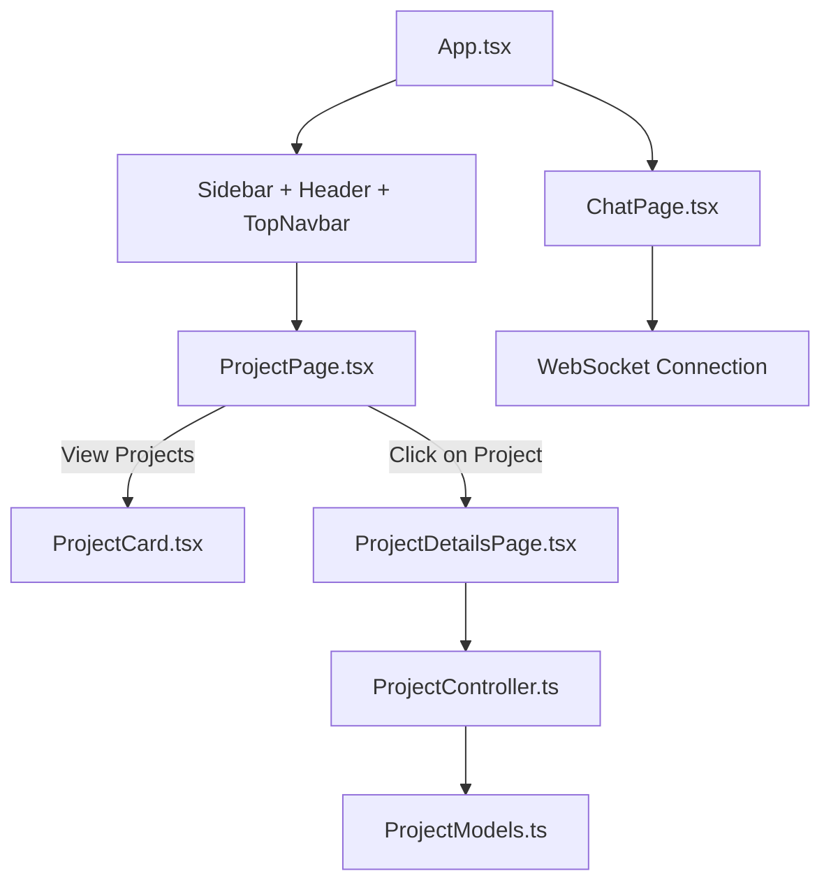

# ERRGO

A collaborative React + TypeScript + Vite project for managing and chatting about projects.

## ✨ Features

* Project listing and detailed view
* WebSocket-based real-time chat system
* Modular frontend structure with Tailwind CSS
* REST-based project management (create/view)
* Proper controller-model pattern for handling project data

---

## 🚀 Getting Started

### 1. Clone the Repository

```bash
git clone https://github.com/Chandra-Sekhar-Dutta/ERRGO.git
cd ERRGO/interview-code
```

### 2. Install Dependencies

```bash
npm install
```

### 3. Run the Development Server

```bash
npm run dev
```

### 4. Open the App

Visit [http://localhost:5173/project](http://localhost:5173/project) in your browser.

---

## 📝 Instructions

* The project contains **8 TODOs** and **1 BONUS task**.
* Your main focus should be enabling project creation and allowing detailed views.
* Chatting via WebSockets is handled in `ChatPage.tsx`.

---

## 🧱 Folder Structure

```
ERRGO/
├── assets/                # Static files
├── components/            # Reusable UI components
├── controller/            # Logic for handling project actions
├── models/                # Data models (e.g., ProjectModels.ts)
├── pages/                 # Page-level components like ProjectPage, ChatPage
├── public/                # Public static files
├── src/
│   ├── App.tsx           # Root component
│   ├── main.tsx          # Vite entry point
│   ├── index.css         # Global styles (Tailwind)
├── tsconfig*.json        # TypeScript config
├── vite.config.ts        # Vite config
└── README.md
```

---

## 🚪 Chat Functionality

* Implemented using WebSocket
* Found in `ChatPage.tsx`
* Allows real-time messaging with simple socket logic

---

## 📊 Project Flow Diagram (Mermaid)



---

## 📄 License

This project is licensed under the MIT License.

---

## ✉️ Contact

If you have questions, feel free to contact:

**Chandra Sekhar Dutta**
[GitHub Profile](https://github.com/Chandra-Sekhar-Dutta)
Email: [chandradutta.cs@gmail.com](mailto:chandradutta.cs@gmail.com)
